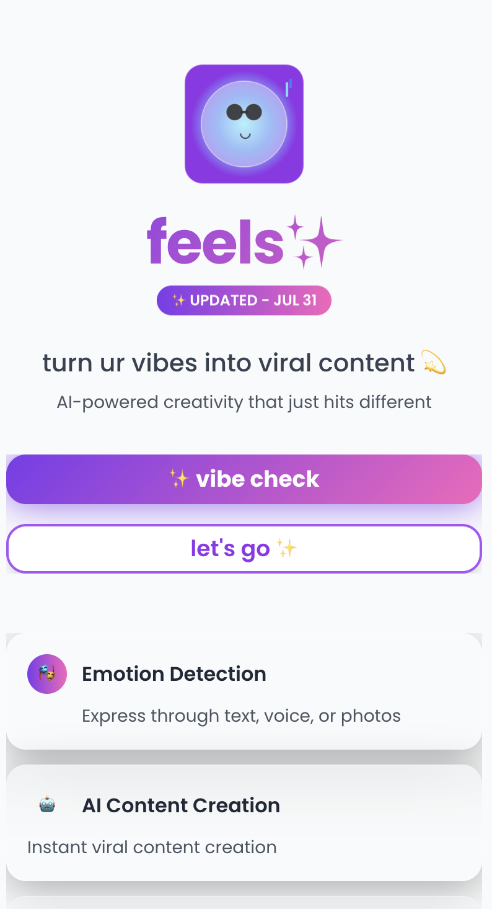
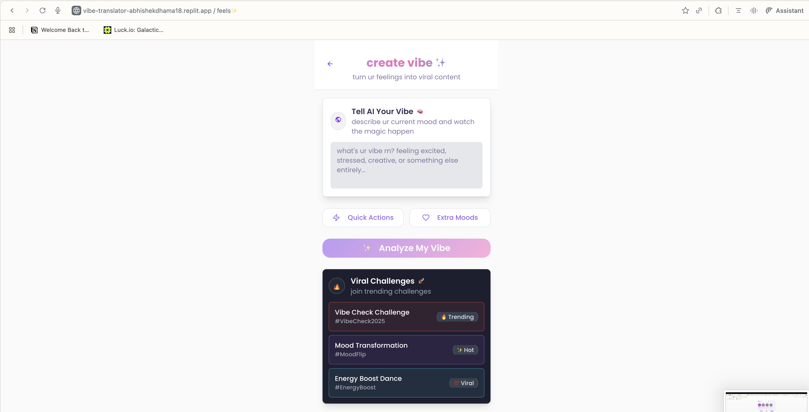
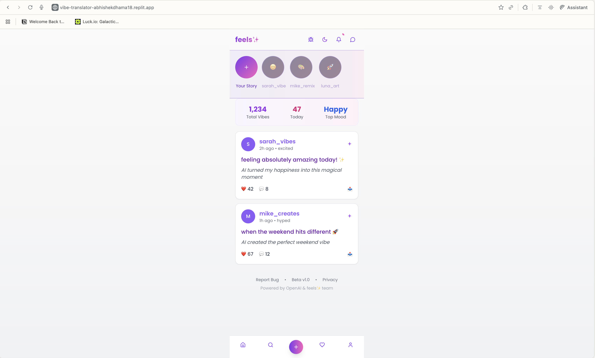

# ✨ feels — Turn Your Vibes into Viral Content ✨

feels is an AI-powered meme & content generator that transforms your mood into instantly shareable creations.  
Built for Gen Z creators who want **fast, authentic, and fun tools** that just hit different.

🔗 **Live Demo:** [Try Feels here](https://vibe-translator-abhishekdhama18.replit.app/)  
📊 **Pilot Report:** See `/docs/17-pilot-report.md`  

---

## 🎯 What It Does
- 🪞 **Emotion Detection**: Express how you feel via text, voice, or photo.  
- ⚡ **AI Content Creation**: Generate memes, captions, and visuals in seconds.  
- 🔄 **Remix & Share**: Participate in viral challenges and remix other people’s vibes.  
- 📈 **Analytics Built-In**: Tracked usage via Google Analytics to validate adoption.  

---

## 📸 Screenshots

  
  
   

---

## 📊 Pilot Metrics (from GA, Aug 2025)
- **Users:** 3 early users  
- **Events:** 14 tracked interactions  
- **New Users:** 3  
- **Traffic Sources:** Organic Social + Direct  
- **Geographies:** UAE, Thailand, Vietnam  
- **Engagement Flow:** Users created vibes, viewed feed, and explored challenges  

---

## 🗺 Roadmap
- **Now:** MVP live (vibe → meme flow, GA instrumentation, remix challenges)  
- **Next:** Improve output quality; refine virality loop; track creation-to-share conversion  
- **Later:** Mobile-first version; creator leaderboards; D1 retention experiments  

---

## 📄 License
MIT — see [LICENSE.md](./LICENSE.md)

---

## 🙌 A Note from the Maker
Hi, this is Abhishek Dhama, Product Manager.
I'd like to mention here that feels started as a playful experiment:  
> Could a single person ship a Gen Z-facing AI app in under two weeks and test if people would use it?  

This repo documents that journey — design, analytics, and lessons learned.  
Feedback is welcome on both the **product** and the **approach**.  
